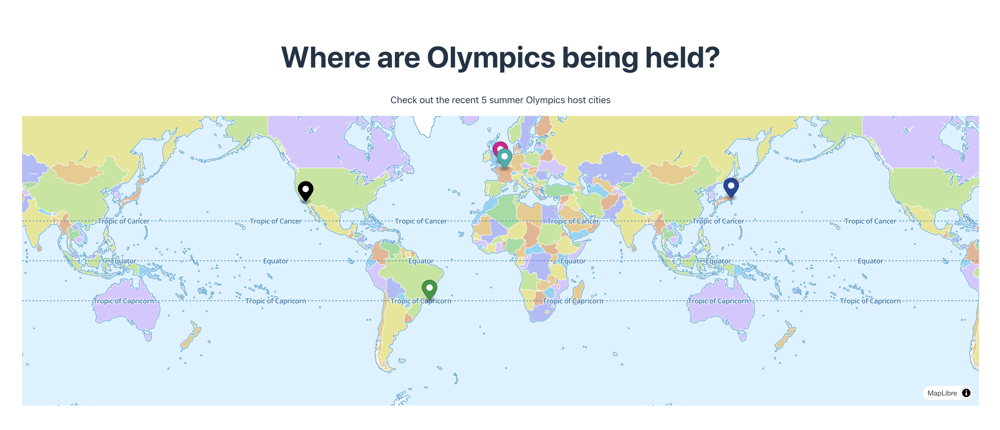
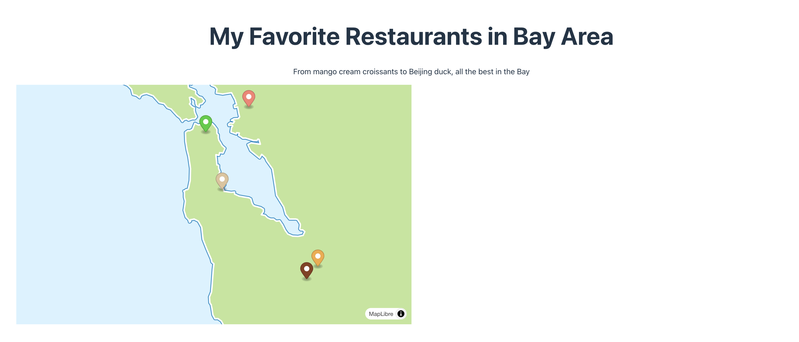
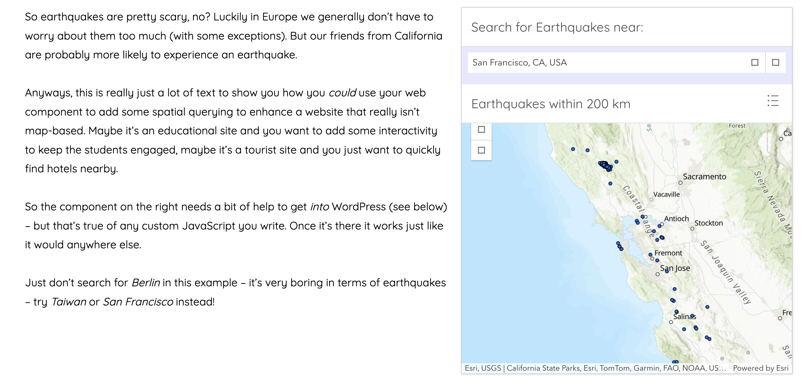

# Using map web component in blogs

This root folder contains two very simple blog-style pages that use the `mplibre-point-map` to display a simple map. The goal is to show the a simple but clear example of using custom map web components in a blog site and inspire more exciting future works of including map as web components in non-GIS pages.

### Technologies in the two blogs:

- Blog: [MDX](https://mdxjs.com/)
- Framework: React 19 with Vite
  - using [React 19](https://vercel.com/blog/whats-new-in-react-19) for it's better suppot in components without React wrapper
  - combined MDX support with [`@mdx-js/rollup`](https://mdxjs.com/packages/rollup/)

### Get started:

- Run `npm install` in the root directory
- Build `@omar/mlibre` in the root directory using `npm run build`
- Run `npm install` in this directory (i.e., `/sample`)
- Start the development server with `npm run dev`

### Further reading: using web components in WordPress

WordPress is the leading Content Management System. You can also include custom web map components in WordPress, as shown in the [example](https://iadevelopment.wpengine.com/esri-european-developer-summit-berlin-2022-web-components-demo/)

The [component](https://demos.alt.esriuk.com/esri-dev-summit-europe-2022/stencil-find-and-list-component/demo/index.html) uses location service and spatial querying to find earthquakes near a certain location, and visualize them in maps or as lists. The component is built with [stencil](https://stenciljs.com/), [Calcite Design System](https://developers.arcgis.com/calcite-design-system/), and [ArcGIS Maps SDK for JavaScript](https://developers.arcgis.com/javascript/latest/).

Using the WordPress [`add_action()`](https://developer.wordpress.org/reference/functions/add_action/) function to inject the correct JavaScript to help with web components. This needs to be in a plugin or in the `functions.php` in your WordPress child theme to work.

Additional resources about using web components in WordPress:

- [Craig West: Web components in WordPress and Gutenberg, and as HTML plugins](https://wordpress.tv/2021/05/28/craig-west-web-components-in-wordpress-and-gutenberg-and-as-html-plugins/)
- [Using Web Components in WordPress is Easier Than You Think](https://css-tricks.com/using-web-components-in-wordpress-is-easier-than-you-think/)
