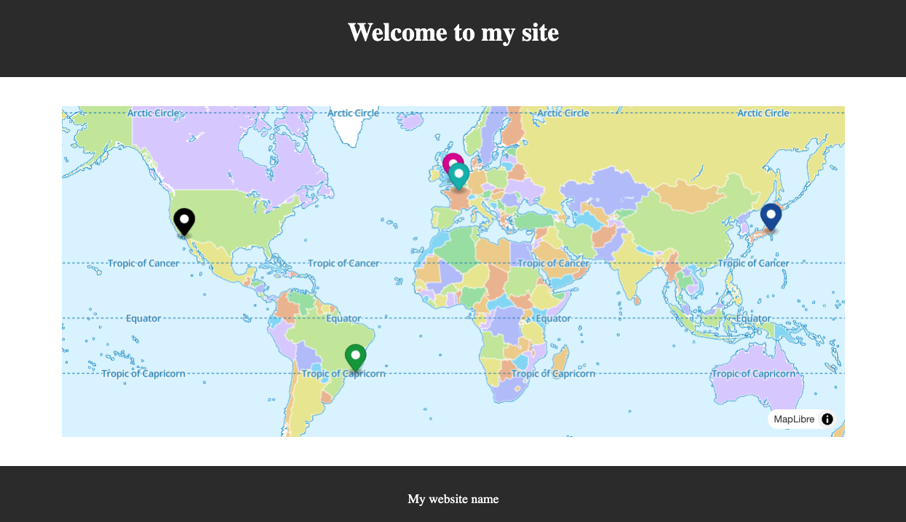

# Vue sample for testing our web component

This sample project was built with `npm create vite@latest`

## Get started

- Run `npm install` in the root directory
- Build `@omar/mlibre` in the root directory using `npm run build`
- Run `npm install` in this directory (i.e., `/sample`)
- Start the development server with `npm run dev`

